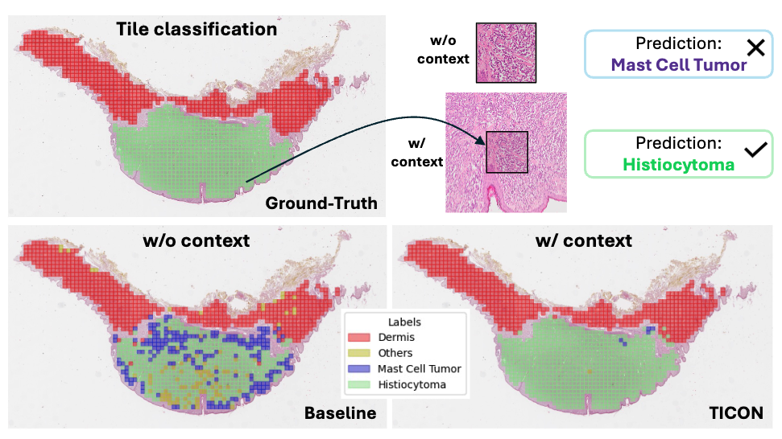
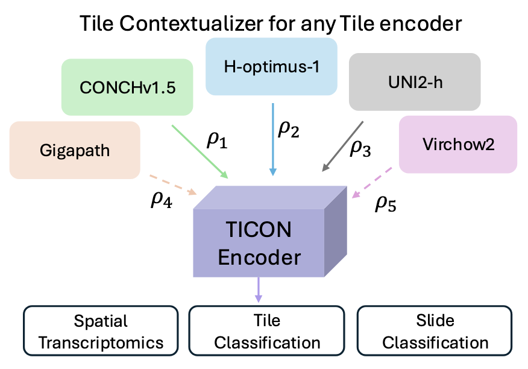

# TICON
**TICON: A Slide-Level Tile Contextualizer for Histopathology Representation Learning** \[[Website](https://cvlab-stonybrook.github.io/TICON/)\]

<p align="center">

</p>
<p align="center">

</p>

## Inference

```
from ticon_model import __model_loader__
import torch
import einops
from torch.backends.cuda import sdp_kernel

# download from https://huggingface.co/varunb/TICON/blob/main/backbone/checkpoint.pth
model_loader_args = {
		"config_path" :  "./configs/config_v1.yaml",
		"pretrained_weights" : "path to checkpoint", 
}

model = __model_loader__(**model_loader_args)
	
# random tile embeddings with batch size 1
torch.manual_seed(0)
tile_embeddings = torch.rand((1, 16, 16, 1536)).to("cuda:0")
tile_encoder_key = "hoptimus1"

# prepare coords for grid of embeddings
coords = torch.linspace(0, 15, 16)
y, x = torch.meshgrid(coords, coords, indexing='ij')
relative_coords = torch.stack((x, y), dim=-1)[None, :, :, :].to(torch.float32)

# flatten
tile_embeddings = einops.rearrange(tile_embeddings, '1 m n d -> 1 (m n) d').to("cuda:0")
relative_coords = einops.rearrange(relative_coords, '1 m n d -> 1 (m n) d').to("cuda:0")
precision =  torch.bfloat16

with torch.inference_mode(), torch.amp.autocast(device_type='cuda', dtype=precision, enabled=(precision != torch.float32)):
	with sdp_kernel(enable_flash=True, enable_mem_efficient=False, enable_math=False):
		contextualized_tile_embeddings = model.forward(x=tile_embeddings, 
								relative_coords=relative_coords, tile_encoder_key=tile_encoder_key)

```


## License
This project is licensed under the [Apache-2.0 License](LICENSE) - see the LICENSE file for details.

Also please check the license of tile encoders - [CONCHv1.5](https://huggingface.co/MahmoodLab/conchv1_5), [H-optimus-1](https://huggingface.co/bioptimus/H-optimus-1), [UNI2-h](https://huggingface.co/MahmoodLab/UNI2-h), [Gigapath](https://github.com/prov-gigapath/prov-gigapath), [Virchow2](https://huggingface.co/paige-ai/Virchow2)

## Acknowledgements
The code is motivated from and build upon [CAPI](https://github.com/facebookresearch/capi), [CrossMAE](https://github.com/TonyLianLong/CrossMAE), [MAE](https://github.com/facebookresearch/mae) 


